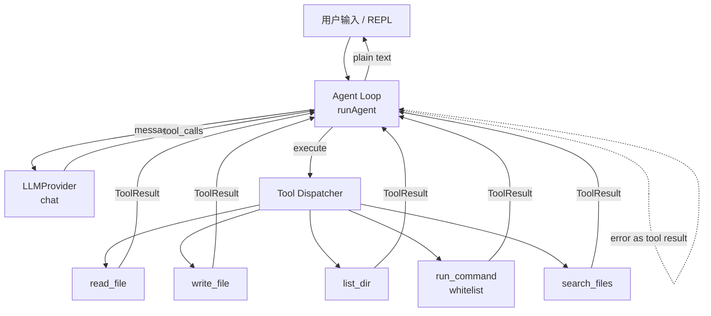

# coding-agent-cli

一个用 Node.js + TypeScript 写的**命令行 Coding Agent**，完整演示 **Function Calling / Tool Calling** 的闭环：LLM 决定调用工具 → CLI 真正执行 → 工具结果喂回 LLM → 直到 LLM 给出纯文本最终回答。

内置 **Mock LLM**，不需要任何 API Key 即可跑通完整流程；同时预留了 `OpenAICompatibleProvider` 的接入点，把环境变量配好就能换成真实模型。

## 架构图



## 快速开始

```powershell
cd coding-agent-cli
npm install
npm run demo
```

你会看到：

1. Agent 调用 `write_file` 在 `./workspace/hello.ts` 写入一段 TypeScript 代码；
2. Agent 调用 `run_command` 执行 `node hello.ts`；
3. Agent 把工具输出汇总成一句自然语言回答。

也可以：

```powershell
npm run dev            # 进入 REPL 多轮对话
npm run dev "在 workspace 下创建 hello.ts 并运行它"   # 单条指令
npm run build          # tsc 编译到 dist/
```

## 工具列表

| 工具 | 作用 | 安全边界 |
| --- | --- | --- |
| `read_file(path)` | 读 UTF-8 文件 | 限制在 `./workspace/` 子树，路径越界抛错 |
| `write_file(path, content)` | 写文件，自动建父目录 | 同上，禁止 `../` 逃逸 |
| `list_dir(path)` | 列目录 | 同上 |
| `run_command(cmd)` | 子进程执行命令 | 白名单：`node`、`npm run <script>`、`dir`、`echo`；5s 超时；cwd 固定为 workspace |
| `search_files(keyword)` | 递归 grep 子串 | 跳过 `node_modules` / 隐藏目录 |

## 接真实 OpenAI 兼容 API

代码里已经留好 `OpenAICompatibleProvider`（`src/llm.ts`）。要接真实模型时：

1. 把 `chat()` 里的 stub 替换成 `POST ${OPENAI_BASE_URL}/chat/completions`，把 `tools` 字段（见 `toolSchemas()`）和 `messages` 一起发过去；
2. 解析返回里的 `tool_calls`，映射到本仓库的 `ToolCall` 结构；
3. 设置 `USE_REAL_LLM=1`、`OPENAI_API_KEY=...`、`OPENAI_BASE_URL=...` 后运行即可。

> 本仓库按岗位要求**不**直接发起真实外部 LLM 调用，因此真实请求体刻意留空。

## 面试可复用点（Function Calling 闭环）

- **契约最小化**：Agent Loop 只依赖 `LLMProvider.chat(messages)` 一个接口，Mock / 真实模型可互换。
- **错误即数据**：工具抛错不会中断循环，而是包装成 `is_error: true` 的 tool message 喂回 LLM，让模型自己决定重试 / 换工具 / 放弃——这是真实 Agent 系统里非常关键的一环。
- **上下文裁剪**：保留 system prompt + 最近 N 条消息，避免长对话 token 爆炸。
- **沙箱与白名单**：所有文件操作被限制在 `./workspace/`，命令执行走白名单 + 超时，演示了"Agent 调用真实工具"时的最小安全设计。
- **deterministic demo**：Mock LLM 是规则驱动的，CI / 面试官复现结果完全一致，不会因为模型波动而翻车。

## 局限

- Mock LLM 是写死的决策树，只覆盖 hello-world 这条路径；自由提问只会返回提示语。
- `run_command` 没有走 shell，因此不支持管道 / 重定向 / `&&`。
- 没有流式输出、没有 token 计费、没有持久化会话。
- 真实 `OpenAICompatibleProvider` 的 HTTP 调用刻意未实现，只保留类型与 env 读取。
